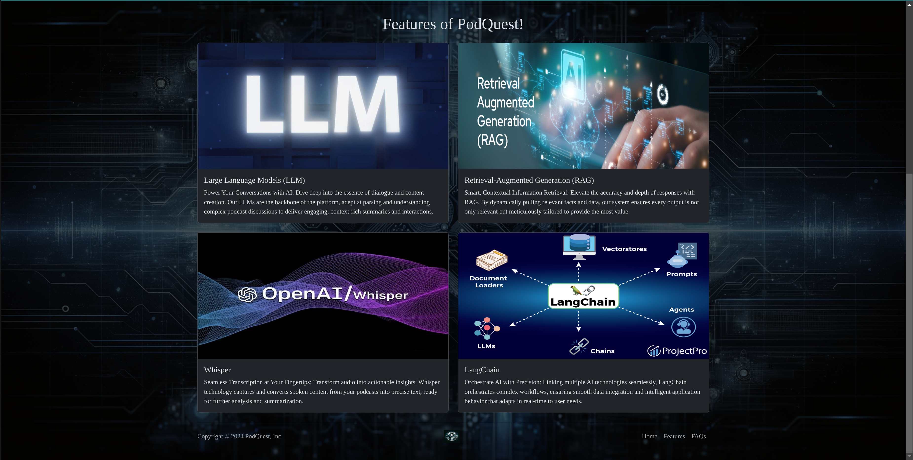
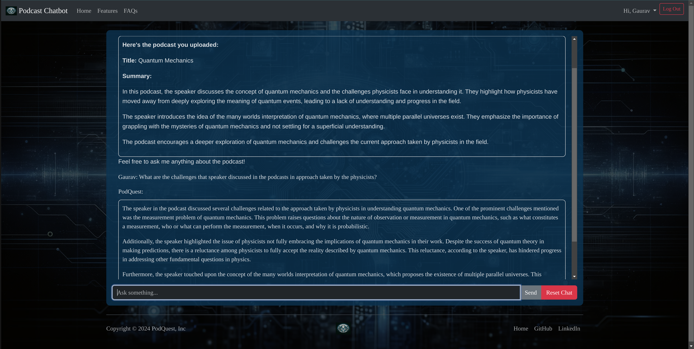

# PodQuest: Unleashing the Power of Podcasts with Advanced AI-Driven Querying Technology

PodQuest is an advanced AI chatbot that transforms podcast listening into an interactive experience. This chatbot leverages cutting-edge AI technologies to transcribe podcasts, understand the content, and engage with users in a conversation about it. You can ask it anything about the podcast—details, explanations, or summaries—and get instant, intelligent responses. It is designed for anyone who wants to quickly grasp complex topics without needing to sift through hours of audio, making learning from podcasts as easy as having a chat.

## Key Features

- **Dynamic Content Interaction**: Engage with podcasts through an interactive AI-powered chat interface.
- **Advanced Transcription**: Utilize Whisper for accurate and swift audio-to-text transcription.
- **Intelligent Query Processing**: Incorporate Pinecone for efficient data retrieval and OpenAI's GPT-3.5 Turbo for context-aware responses.
- **Seamless Workflow Integration**: LangChain orchestrates complex workflows, enhancing AI interactions.

## Workflow

The application's workflow is optimized for efficiency:
- **Content Downloading**: Automatically downloads content from YouTube links.
- **Audio Processing**: Converts video to audio as needed.
- **Transcription and Analysis**: Transcribes audio and breaks down transcripts into manageable chunks.
- **Data Retrieval and Response Generation**: Stores embeddings in Pinecone, uses LangChain for retrieval, and generates responses.

## Enhanced Real-Time Interaction

PodQuest uses Celery for asynchronous task management, ensuring that all backend processes like audio downloading and transcription run smoothly without blocking user interactions. Real-time updates and dynamic content loading are handled efficiently using Websockets, providing users with a seamless and responsive experience.

## Getting Started

1. **Clone the repository**:
   ```bash
   git clone https://github.com/gauravv0412/PodQuest-AI-Podcast-Chatbot.git
   cd podquest
2. **Set up the environment**:
   ```bash
   pip install -r requirements.txt
3. **Configure your services**:
   - Set up your Pinecone API key and Whisper model in the configuration file.
   - Ensure Celery and your message broker (e.g., Redis) are configured correctly.
4. **Run the application**:
   ```bash
   python manage.py runserver
5. Visit your application:
   - Open your browser and navigate to localhost:8000 to start interacting with PodQuest.
## Screenshots

- **Home Page**  
- **SignUp & Login View**:  
- **Chat Loading Page**: 
- **Chat Interface**:  

